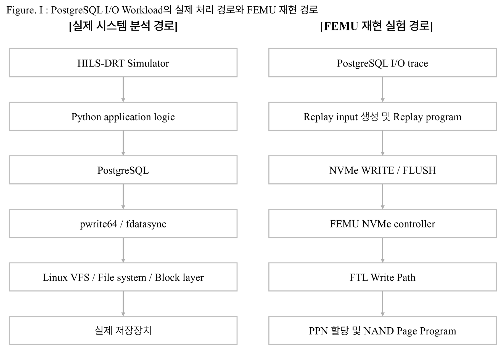
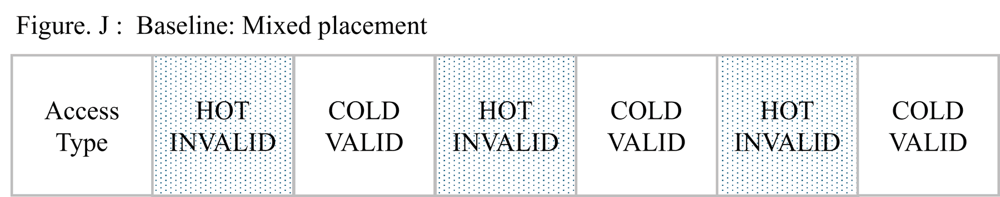
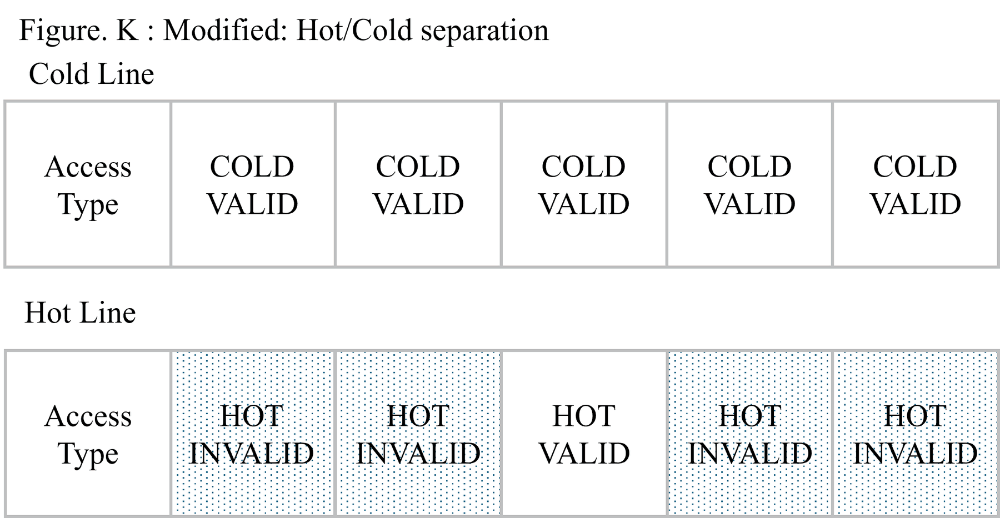
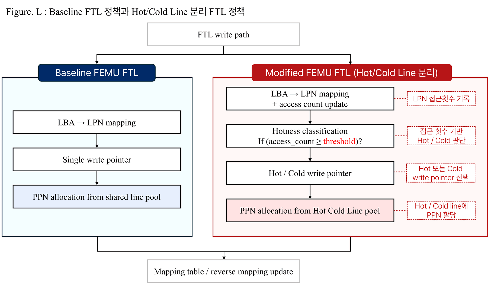
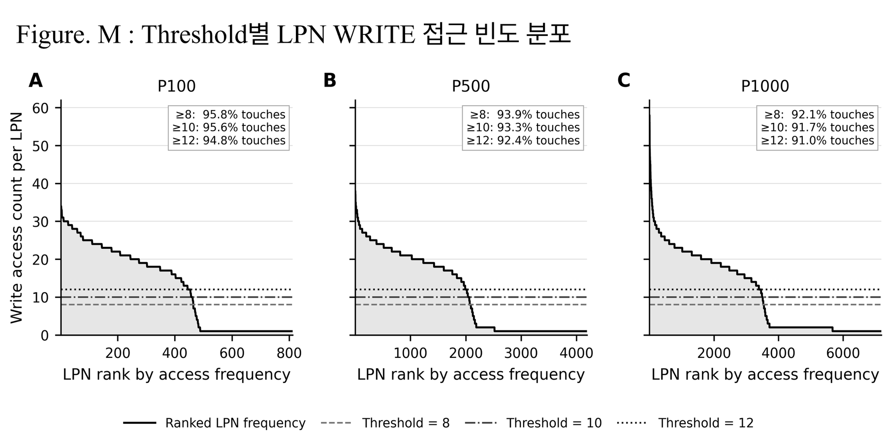
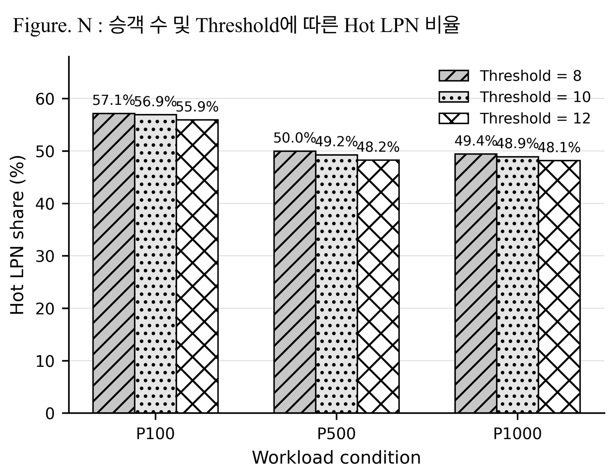
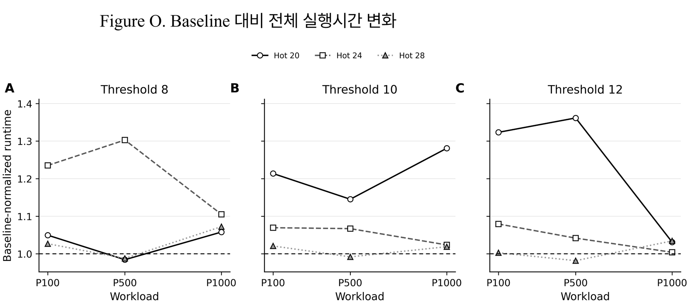
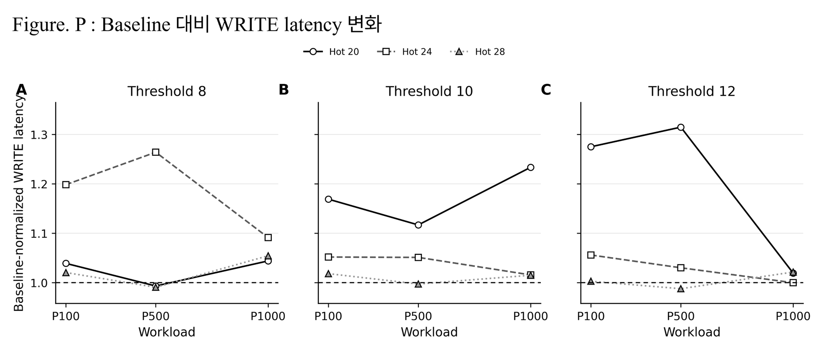
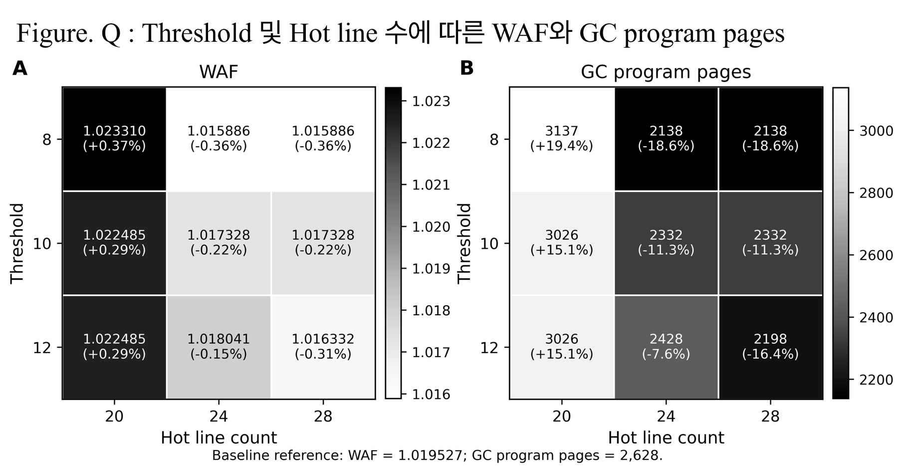

# FEMU Hot/Cold FTL Study

A systems-research project that starts from a PostgreSQL-heavy application workload, replays the resulting storage I/O on FEMU, modifies the BlackBox FTL with hot/cold LPN placement, and evaluates both device-internal and host-visible effects.

> **Upstream project:** [MoatLab/FEMU](https://github.com/MoatLab/FEMU)  
> **Modified source included:** [`src/modified/ftl.c`](src/modified/ftl.c), [`src/modified/ftl.h`](src/modified/ftl.h)  
> **Historical base commit:** not recorded in the experiment materials; the patch directory documents the nearest pre-experiment upstream reference without claiming it as the exact local base.

## 1. From application I/O to FEMU replay

The project began with an end-to-end runtime investigation of a Demand Responsive Transportation simulator. Profiling pointed to frequent PostgreSQL write/commit activity, and system-call tracing showed repeated `pwrite64` and `fdatasync`/`fsync` operations. The PostgreSQL trace was converted into NVMe `WRITE` / `FLUSH` requests and replayed on FEMU so that the FTL path could be modified and measured directly.



The replayed workloads contain:

| Workload | WRITE | FLUSH | Dominant WRITE size |
|---|---:|---:|---|
| P100 | 4,841 | 4,686 | ~95% 8 KB |
| P500 | 21,800 | 20,609 | ~95% 8 KB |
| P1000 | 37,335 | 34,304 | ~95% 8 KB |

See [`workloads/README.md`](workloads/README.md) for what is and is not preserved in this repository.

## 2. Hypothesis: separate hot and cold data

Baseline FEMU places repeatedly updated pages and less-frequently updated pages through the same write pointer and physical line pool. Repeatedly updated pages therefore create invalid pages inside lines that may still contain cold valid pages, increasing valid-page copying during garbage collection.



The modified policy classifies an LPN as hot after its cumulative write count reaches a threshold and allocates hot/cold pages through separate write pointers and line ranges.



The working hypothesis was:

**If hot and cold pages are separated physically, invalid pages should become more localized, reducing GC copy work and write amplification.**

## 3. FTL implementation

The implementation is in the complete modified source files under [`src/modified/`](src/modified/). The main additions are:

- per-LPN access counter: `lpn_access_cnt[lpn]`
- threshold classifier: `is_hot()`
- hot/cold physical line ranges controlled by `HOT_LINE_CNT`
- independent write pointers: `Hwp` and `Cwp`
- range-aware free-line allocation and GC victim selection
- GC relocation that reclassifies an LPN and sends it through the corresponding write pointer
- FTL statistics for host/NAND programs, GC programs, WAF, erase count, and hot/cold program counts



Code-level notes are in [`docs/implementation.md`](docs/implementation.md).

## 4. Parameter selection and experiment matrix

The replay traces show a skewed LPN update-frequency distribution. Thresholds 8, 10, and 12 were selected to test nearby cutoffs while retaining most write traffic in the hot class.





The final matrix was:

| Parameter | Values |
|---|---|
| Hotness threshold | 8, 10, 12 |
| Hot line count | 20, 24, 28 |
| Workload | P100, P500, P1000 |

Host-visible metrics were replay runtime and average WRITE latency. Device-internal metrics were GC program pages and WAF.

## 5. Host-visible result: no robust speedup





The Hot/Cold policy did **not** produce a consistent end-to-end improvement. The best P500 runtime in the tested grid was `TH=12, HOT_LINE_CNT=28`, approximately **1.82% below** the paired baseline. The best tested P100 and P1000 runtime configurations were still approximately baseline-level or slower.

This is an important negative result: reducing FTL-internal work is not sufficient by itself to guarantee lower host-observed latency.

## 6. Device-internal result: GC work decreased



The paired baseline generated **2,628 GC program pages**. The minimum was **2,138** at `TH=8, HOT_LINE_CNT=24/28`, a **18.65% reduction**. Baseline WAF was **1.019527** and the minimum observed WAF was **1.015886**, approximately **0.36% lower**.

A too-small hot region (`HOT_LINE_CNT=20`) increased GC work, showing that classification alone is not sufficient; the physical capacity allocated to each class matters.

## 7. Main takeaway

The project produced a more useful systems question than a simple “optimization works/does not work” conclusion:

> **Under what conditions does a device-level optimization propagate to host-visible performance?**

For this replay, hot/cold placement can reduce GC copy work, but that gain does not consistently dominate synchronization, queueing, emulation, filesystem, and application-level effects above the FTL.

## 8. Repository layout

```text
.
├── src/modified/
│   ├── ftl.c
│   └── ftl.h
├── patches/
│   └── README.md
├── scripts/
│   ├── replay_workload.sh
│   ├── run_experiment.sh
│   └── analyze_results.py
├── workloads/
│   └── README.md
├── figures/                      # Figures extracted directly from the original PPT
├── results/summary/
├── docs/
├── LICENSE
└── NOTICE.md
```

## 9. Reproducibility status

This repository preserves the full modified FTL source, original presentation figures, experiment summaries, and helper scripts for reconstructing the workflow. It does **not** claim one-command reproduction because the exact historical FEMU base commit and the original trace-conversion/replay program were not preserved in the supplied experiment materials.

The helper scripts in `scripts/` are repository-side wrappers reconstructed from the documented workflow; they are not presented as the original experiment scripts. See [`docs/reproducibility.md`](docs/reproducibility.md) and [`patches/README.md`](patches/README.md).

## 10. License and attribution

FEMU is released under the GNU General Public License v2.0. The modified FEMU source files in this repository are redistributed under the same license. See [`LICENSE`](LICENSE) and [`NOTICE.md`](NOTICE.md).
